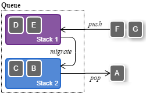

# Quebic - Simple Journaling Queue Library

**Quebic** is a simple and small journaling queue library based on local filesystem. It is aimed for using this in
pipeline data processing especially machine learning or ETL. Quebic supports 1:1 queue operation for multi-thread or
multi-process environment.

Once a data is pushed into queue, it will be able to read at the next time even if the process goes down. In addition,
the last pushed data remains in queue and it can refer anytime even if the queue is empty. This allows your
application's process to determine where it should resume from. You can also use this queue files as intermediate data
store for the next data processing step.

This library is implemented with a double-stacking queue using only two files. Therefore, there may be little severe
impact of file lock as far as you use this as 1:1.

## Features

* Persistent queue that can stop and restart processing.
* Process large amounts of data that exceed JavaVM heap.
* Remember the latest push data to determine restart position.
* Compression option for efficient storing large JSON or vector.
* Data type verification with simple schema.
* Simple two-files data store.
* 1:1 lock-based parallel push and pop.

## Sample

When you use Quebic in your project, you should:

1. determine what type `T` that you want to push into queue.
2. implement `Value2Struct[T]` to specify schema of queue and transform your queue-data `T` to schema.
3. determine limit items to keep queue as `capacity`.

```scala
import java.io.File
import java.util.Timer
import at.hazm.quebic.{Codec, DataType, Schema, Struct, Queue}

case class YourData(id:Int, text:String)

case object YourData2Struct extends Queue.Value2Struct[YourData] {
  def schema:Schema = Schema(DataType.INTEGER, DataType.TEXT)

  def from(data:YourData):Struct = Struct(Struct.INTEGER(data.id), Struct.TEXT(data.text))

  def to(struct:Struct):YourData = struct match {
    case Struct(Struct.INTEGER(id), Struct.TEXT(text)) => YourData(id.toInt, text)
  }
}

val timer = new Timer("ScheduledMigrationThread")   // scheduled migration thread
val file = new File("my-queue.qbc")
val capacity = 64 * 1024
val queue = new Queue(file, capacity, YourData2Struct, timer)

val pub = new queue.Publisher(Codec.PLAIN)
pub.push(YourData(0, "hello, world"))

val sub = new queue.Subscriber()
val yourData = sub.pop()

// When your program going to finish.
queue.close()
timer.cancel()

// If you wish to delete all queue-related files.
// queue.dispose()
```

### Reference Score of Performance

Followings are the score of push and pop operation on DELL OptiPlex 7050 with Windows 10, Core i7-7700 3.6GHz CPU, 16GB
memory, NTFS on HDD (not SSD).

In single thread, push - migration - pop sequential operation for 1kB binary item:

| Operation | Call  | Time     | Time/Call |
|:----------|------:|---------:|----------:|
| PUSH      | 2,781 | 10,002ms | 3.597ms   |
| POP       | 2,781 | 6,114ms  | 2.198ms   |
| MIGRATION | 2,782 | 52ms     | 0.019ms   |

## Internal Implementation

Quebic is based on double-stack queue.

